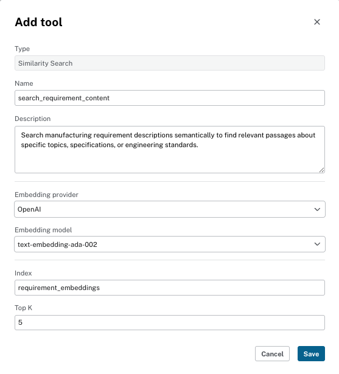

# Lab 2: Aura Agents

In this lab, you will build an AI-powered agent using Neo4j Aura Agent. The agent will help users explore manufacturing product development data by combining semantic search, graph traversal, and natural language queries - all without writing any code.

## Prerequisites

- Completed **Lab 0** (Sign In)
- Completed **Lab 1** (Neo4j Aura setup with backup restored)

The pre-built backup you restored in Lab 1 already contains the complete knowledge graph with embeddings, so you can start building agents immediately.

## Step 1: Create the Manufacturing Agent

1. Go to [console.neo4j.io](https://console.neo4j.io)
2. Select **Agents** in the left-hand menu
3. Click on **Create Agent**


## Step 2: Configure Agent Details

Configure your new agent with the following settings. It is critical that you give your agent a unique name so that it does not conflict with other users' agents in the shared environment. If you have an error try another unique name by adding your initials or a number.:

**Unique Agent Name:** `ryans-manufacturing-analyst`

**Description:** An AI-powered manufacturing analyst that helps users explore product development data, analyze component requirements, investigate defects and test results, and discover traceability relationships across the knowledge graph.

**Prompt Instructions:**
```
You are an expert manufacturing engineering assistant specializing in product development traceability.
You help users understand:
- Product structure across technology domains and components
- Engineering requirements and how they relate to components
- Test coverage, defects, and their severity
- Change proposals and their impact on requirements

Always provide specific examples from the knowledge graph when answering questions.
Ground your responses in the actual data from the manufacturing traceability graph.
```

**Target Instance:** Select your Neo4j Aura instance created in Lab 1.

**External Available from an Endpoint:** Enabled


## Step 3: Add Cypher Template Tools

Click **Add Tool** and select **Cypher Template** for each of the following tools:

### Tool 1: Get Component Overview

**Tool Name:** `get_component_overview`

**Description:** Get comprehensive overview of a component including its requirements, technology domain, and associated defects.

**Parameters:** `component_name` (string) - The component name to look up (e.g., "HVB_3900", "PDU_1500")

**Cypher Query:**
```cypher
MATCH (comp:Component {name: $component_name})
OPTIONAL MATCH (td:TechnologyDomain)-[:DOMAIN_HAS_COMPONENT]->(comp)
OPTIONAL MATCH (comp)-[:COMPONENT_HAS_REQ]->(req:Requirement)
OPTIONAL MATCH (req)-[:TESTED_WITH]->(ts:TestSet)-[:CONTAINS_TEST_CASE]->(tc:TestCase)-[:DETECTED]->(d:Defect)
WITH comp, td,
     collect(DISTINCT req.name)[0..10] AS requirements,
     collect(DISTINCT d.description)[0..5] AS defects
RETURN
    comp.name AS component,
    comp.description AS description,
    td.name AS technology_domain,
    requirements AS top_requirements,
    defects AS detected_defects
```


### Tool 2: Find Shared Requirements Between Components

**Tool Name:** `find_shared_requirements`

**Description:** Find requirements or characteristics that two components have in common based on their technology domain or testing patterns.

**Parameters:**
- `component1` (string) - First component name
- `component2` (string) - Second component name

**Cypher Query:**
```cypher
MATCH (c1:Component {name: $component1})-[:COMPONENT_HAS_REQ]->(r:Requirement)
WITH c1, collect(r) AS reqs1
MATCH (c2:Component {name: $component2})-[:COMPONENT_HAS_REQ]->(r2:Requirement)
WITH c1, c2, reqs1, collect(r2) AS reqs2
RETURN
    c1.name AS component_1,
    c2.name AS component_2,
    size(reqs1) AS component_1_requirements,
    size(reqs2) AS component_2_requirements
```


## Step 4: Add Similarity Search Tool

Click **Add Tool** and select **Similarity Search** to configure a semantic search tool using the existing vector index:

**Tool Name:** `search_requirement_content`

**Description:** Search manufacturing requirement descriptions semantically to find relevant passages about specific topics, specifications, or engineering standards.

**Configuration:**
- **Embedding provider:** `openai`
- **Embedding model:** `text-embedding-ada-002`
- **Vector Index:** `requirement_embeddings`
- **Top K:** 5



## Step 5: Add Text2Cypher Tool

Click **Add Tool** and select **Text2Cypher** to enable natural language to Cypher translation:

**Tool Name:** `query_database`

**Description:** Query the manufacturing knowledge graph using natural language. This tool translates user questions into Cypher queries to retrieve precise data about products, their components, engineering requirements, test cases, defects, and change proposals. Use this for ad-hoc questions that require flexible data exploration beyond the pre-defined Cypher templates.


## Step 6: Test the Agent

Test your agent with the sample questions below. After each test, observe:
1. Which tool the agent selected and why
2. The context retrieved from the knowledge graph
3. How the agent synthesized the response
4. Tool explanations showing the reasoning process

### Cypher Template Questions

Try asking: **"Tell me about the HVB_3900 component and any defects found"**

The agent recognizes this matches the `get_component_overview` template and executes the pre-defined Cypher query with "HVB_3900" as the parameter.


We can see the agent's reasoning for selecting the `get_component_overview` tool and how it synthesized the response into a readable format:


Other Cypher template questions to try:
- "Compare the requirements between HVB_3900 and PDU_1500" - Uses the `find_shared_requirements` template to compare two components.

### Semantic Search Questions

Try asking: **"What do the requirements say about thermal management and cooling?"**

The agent uses the similarity search tool to find semantically relevant passages from requirement descriptions, then synthesizes insights about thermal management specifications.


Other semantic search questions to try:
- "Find requirements related to safety monitoring" - Searches for passages discussing safety standards and monitoring systems.
- "What specifications exist for energy density?" - Finds relevant energy and battery performance requirements.

### Text2Cypher Questions

Try asking: **"Which component has the most requirements?"**

The agent translates this natural language question into a Cypher query that counts requirements per component and returns the highest.


Other Text2Cypher questions to try:
- "How many defects have high severity?" - Generates a query to count Defect nodes filtered by severity.
- "What changes have been proposed that affect battery requirements?" - Creates a query to find Change nodes connected to requirements.

## Step 7: (Optional) Deploy to API

Deploy your agent to a production endpoint:
1. Click **Deploy** in the Aura Agent console
2. Copy the authenticated API endpoint
3. Use the endpoint in your applications

## Summary

You have now built an Aura Agent that combines three powerful retrieval patterns:

| Tool Type | Purpose | Best For |
|-----------|---------|----------|
| **Cypher Templates** | Controlled, precise queries | Specific lookups, comparisons |
| **Similarity Search** | Semantic retrieval | Finding relevant content by meaning |
| **Text2Cypher** | Flexible natural language | Ad-hoc questions about the data |

These same patterns are implemented programmatically in Lab 5 (GraphRAG) and Lab 6 (MCP) using Python.

## Next Steps

**This completes Part 1 - No-Code Getting Started.**

To continue with the coding labs, proceed to **Part 2 - Introduction to Agents and GraphRAG with Neo4j**:

[Lab 4 - Intro to Bedrock and Agents](../Lab_4_Intro_to_Bedrock_and_Agents) - Set up your development environment in Amazon SageMaker and learn how AI agents work with LangGraph.

## Future Tools

These additional Cypher template tools can be added to extend the agent's capabilities:

### Get Technology Domain Components

**Tool Name:** `get_domain_components`

**Description:** Get all components within a specific technology domain and their requirement counts.

**Parameters:** `domain_name` (string) - The technology domain name (e.g., "Electric Powertrain", "Chassis")

**Cypher Query:**
```cypher
MATCH (td:TechnologyDomain {name: $domain_name})-[:DOMAIN_HAS_COMPONENT]->(comp:Component)
OPTIONAL MATCH (comp)-[:COMPONENT_HAS_REQ]->(req:Requirement)
WITH td, comp, count(req) AS req_count
RETURN
    td.name AS technology_domain,
    collect({
        component: comp.name,
        description: comp.description,
        requirement_count: req_count
    }) AS components
```

### List All Components

**Tool Name:** `list_components`

**Description:** List all components in the knowledge graph with their requirement counts.

**Parameters:** None

**Cypher Query:**
```cypher
MATCH (comp:Component)
OPTIONAL MATCH (comp)-[:COMPONENT_HAS_REQ]->(req:Requirement)
WITH comp, count(req) AS req_count
RETURN comp.name AS component, comp.description AS description, req_count
ORDER BY req_count DESC
LIMIT 20
```
