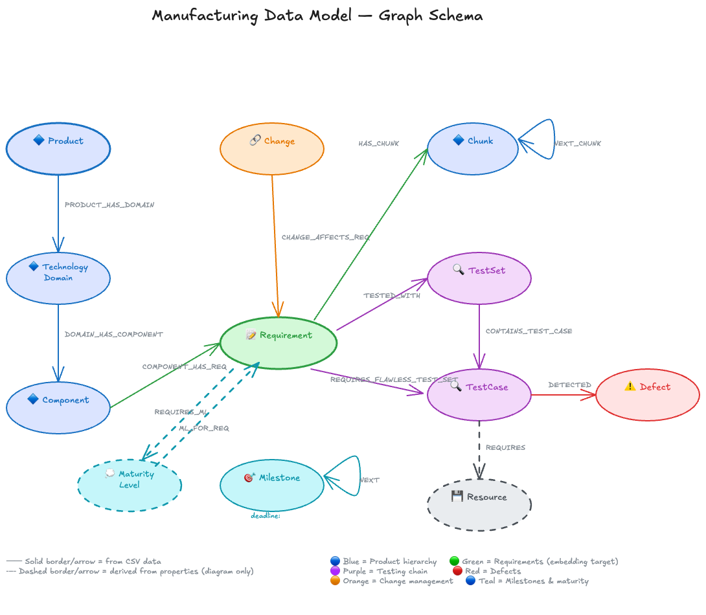

# Hands-On Lab: Neo4j and Amazon Bedrock

Build Generative AI and GraphRAG Agents with Neo4j and AWS.

Neo4j is the [leading graph database](https://db-engines.com/en/ranking/graph+dbms) vendor. We've worked closely with AWS engineering for years. Our products, AuraDB and AuraDS, are offered as managed services available on AWS through the [AWS Marketplace](https://aws.amazon.com/marketplace/seller-profile?id=23ec694a-d2af-4641-b4d3-b7201ab2f5f9).

## Overview

In this hands-on lab, you'll learn about Neo4j, Amazon Bedrock, and the [Model Context Protocol (MCP)](https://modelcontextprotocol.io/). The lab is designed for data scientists, data engineers, and AI developers who want to master GraphRAG (Graph Retrieval-Augmented Generation) techniques and build production-ready agentic AI applications.

In today's landscape, manufacturing organizations need AI systems that can trace product requirements through testing and defect resolution, understand complex component relationships, and build intelligent systems that can autonomously reason over engineering data. This hands-on lab addresses this need directly by providing mastery in the most powerful pattern available for manufacturing traceability intelligence: Graph Retrieval-Augmented Generation (GraphRAG).

You'll work with an automotive manufacturing dataset to learn fundamental GraphRAG patterns. The knowledge graph captures the full product development lifecycle — from product requirements through component design, testing, defect tracking, and change management. You'll implement multiple retrieval strategies: vector similarity search for semantic retrieval, graph-enhanced retrievers that leverage the traceability chain, and natural language to Cypher query generation. Finally, you'll build intelligent agents using LangGraph and Strands that can autonomously reason over your knowledge graph to answer complex engineering questions.

By the end of this lab, you'll have hands-on experience with:
- Exploring a manufacturing traceability knowledge graph
- Implementing semantic search with vector embeddings on engineering requirements
- Creating graph-enhanced retrieval patterns for richer context
- Building no-code AI agents with Neo4j Aura Agents
- Developing agentic AI systems using the Model Context Protocol
- Calling Aura Agents programmatically via REST API
- Deploying GraphRAG applications on AWS infrastructure

These techniques apply to any domain where you need to trace relationships across structured data, understand impact chains, and build AI systems that can reason over complex information networks.

## Starting the Lab

To get started, follow the labs in the agenda below in order.

**Quick Start Options:**
- **No-Code Track Only:** Complete Part 1 (Labs 0-2) to explore Neo4j and AI agents without coding
- **Intro to Agents and GraphRAG:** Complete Parts 1 and 2 (Labs 0-5) to learn GraphRAG fundamentals
- **Full Workshop:** Complete all three parts for the complete GraphRAG development experience

## Prerequisites

You'll need a laptop with a web browser. Your browser will need to be able to access the AWS Console and the Neo4j Aura Console. If your laptop has a firewall you can't control, you may want to bring your personal laptop.

---

## Agenda

### Part 1 - No-Code Getting Started

*This section requires no coding. You'll use visual tools and pre-built interfaces to explore Neo4j and AI agents.*

* Introductions
* Lecture - Introduction to Neo4j
    * What is Neo4j?
    * How is it deployed and managed on AWS?
* [Lab 0 - Sign In](Lab_0_Sign_In)
    * Improving the Labs
    * Sign into AWS
* [Lab 1 - Neo4j Aura Setup](Lab_1_Aura_Setup)
    * Signing up for Neo4j Aura through AWS Marketplace
    * Restoring the pre-built knowledge graph
    * Visual exploration with Neo4j Explore
* [Lab 2 - Aura Agents](Lab_2_Aura_Agents)
    * Building AI agents using Neo4j Aura Agent (no-code)
    * Creating Cypher template tools
    * Adding semantic search and Text2Cypher capabilities
* Break

---

### Part 2 - Introduction to Agents and GraphRAG with Neo4j

*This section introduces you to building AI agents with Python and the fundamentals of GraphRAG (Graph Retrieval-Augmented Generation) using the official neo4j-graphrag library.*

**What You'll Learn:**
- How AI agents use tools to interact with external systems
- The neo4j-graphrag library architecture and components
- Multiple retrieval strategies (Vector, VectorCypher, Hybrid, Text2Cypher)
- Building complete RAG pipelines with the GraphRAG class

**Key Technologies:**
- **LangGraph**: Framework for building stateful, multi-step AI agents
- **neo4j-graphrag**: Neo4j's official Python library for GraphRAG applications
- **VectorRetriever**: Semantic similarity search using embeddings
- **VectorCypherRetriever**: Vector search enhanced with graph traversal
- **GraphRAG**: Orchestration class combining retrieval with LLM generation

* Lecture - Neo4j and Generative AI
    * Generating Knowledge Graphs
    * Retrieval Augmented Generation
    * GraphRAG Patterns
* [Lab 4 - Intro to Bedrock and Agents](Lab_4_Intro_to_Bedrock_and_Agents)
    * Launch SageMaker Studio
    * Clone the workshop repository
    * Configure inference profiles for Bedrock
    * Build a basic LangGraph agent with tool calling

* [Lab 5 - GraphRAG with Neo4j](Lab_5_GraphRAG)
    * Load manufacturing data and create embeddings with Amazon Titan
    * Build vector indexes in Neo4j
    * Implement VectorRetriever for semantic search
    * Use VectorCypherRetriever for graph-enhanced context
    * Build complete GraphRAG pipelines

---

### Part 3 - Advanced Agents and API Integration

*This section covers advanced topics including programmatic access to Aura Agents and building AI agents that query Neo4j using the Model Context Protocol (MCP).*

**What You'll Learn:**
- Calling Aura Agents via REST API for application integration
- The Model Context Protocol (MCP) standard for tool integration
- Building LangGraph agents that can query knowledge graphs
- Using the Neo4j MCP Server via AgentCore Gateway

**Key Technologies:**
- **Neo4j Aura Agents API**: REST API for invoking your no-code agents programmatically
- **Model Context Protocol (MCP)**: Open standard for connecting AI models to data sources
- **Neo4j MCP Server**: Official Neo4j tool server exposing Cypher query capabilities
- **AgentCore Gateway**: AWS service for hosting and managing MCP servers

* [Lab 6 - Neo4j MCP Agent](Lab_6_Neo4j_MCP_Agent)
    * Connect to Neo4j via AgentCore Gateway
    * Build a LangGraph agent with MCP tools
    * Query the knowledge graph with natural language
* [Lab 7 - Aura Agents API](Lab_7_Aura_Agents_API)
    * Call your Lab 2 Aura Agent programmatically
    * OAuth2 authentication with client credentials
    * Build a reusable Python client for application integration
* Questions and Next Steps

---

## Architecture

```
┌─────────────────────────────────────────────────────────────────────────────┐
│                              YOUR AGENTS                                     │
├───────────────────┬─────────────────────────┬───────────────────────────────┤
│   Part 1 (No-Code) │     Part 2 (GraphRAG)   │      Part 3 (Advanced)        │
│  ┌───────────────┐ │  ┌─────────────────────┐ │  ┌─────────────────────────┐  │
│  │ Aura Agents   │ │  │   neo4j-graphrag    │ │  │   Aura Agents API       │  │
│  │ • Templates   │ │  │   • VectorRetriever │ │  │   • REST API Access     │  │
│  │ • Similarity  │ │  │   • VectorCypherR.  │ │  │   • OAuth2 Auth         │  │
│  │ • Text2Cypher │ │  │   • GraphRAG Class  │ │  │   LangGraph + MCP       │  │
│  └───────────────┘ │  └─────────────────────┘ │  │   • Neo4j MCP Server    │  │
│                    │                          │  └─────────────────────────┘  │
└───────────────────┴─────────────────────────┴───────────────────────────────┘
                                    │
                                    ▼
                    ┌───────────────────────────────┐
                    │        Neo4j Aura             │
                    │  Manufacturing Knowledge Graph │
                    │  • Products & Components      │
                    │  • Requirements & Test Cases  │
                    │  • Defects & Change Proposals │
                    │  • Vector Embeddings          │
                    └───────────────────────────────┘
```

## Knowledge Graph Data Model

The knowledge graph represents an automotive manufacturing product development workflow. It tracks how a vehicle product (codenamed "R2D2") moves from high-level product requirements through component design, testing, defect tracking, and change management. The domain is centered around a high-voltage battery system for an electric powertrain.

- **Products & Technology Domains**: Product R2D2 with domains like Electric Powertrain, Chassis, Body, Infotainment
- **Components**: Hardware components such as HVB_3900 (High-Voltage Battery), PDU_1500 (Power Distribution Unit), INV_2300 (Inverter)
- **Requirements**: Bilingual (German/English) engineering requirements with detailed specifications
- **Test Sets & Test Cases**: Structured test plans with scheduling, resources, and status tracking
- **Defects**: Quality issues with severity, priority, and resolution tracking
- **Change Proposals**: Engineering changes with cost impact analysis and risk assessment
- **Vector Embeddings**: Pre-computed embeddings on requirement and defect descriptions for semantic search

Example questions you can answer:
- "What are the thermal management requirements for the high-voltage battery?"
- "Which test cases have detected high-severity defects?"
- "What is the development cost of open change proposals?"
- "Which requirements are affected by change proposal CP001?"

The knowledge graph captures the full **traceability chain** from product definition through testing to defect resolution, a core concern in automotive manufacturing (ISO 26262, ASPICE). This architecture enables multiple retrieval strategies.

### Graph Structure



For detailed documentation of the data model including node properties, relationship sources, traversal patterns, and embedding targets, see [TransformedData/DATA_ARCHITECTURE.md](TransformedData/DATA_ARCHITECTURE.md).

### Node Types

| Node Label | Description | Key Properties |
|------------|-------------|----------------|
| `Product` | Vehicle or product under development | `product_id`, `name`, `description` |
| `TechnologyDomain` | Technology area within a product | `technology_domain_id`, `name` |
| `Component` | Hardware component | `component_id`, `name`, `description` |
| `Requirement` | Engineering requirement (bilingual DE/EN) | `requirement_id`, `name`, `description`, `type` |
| `TestSet` | Group of related test cases | `test_set_id`, `name` |
| `TestCase` | Individual test with schedule and status | `test_case_id`, `name`, `status`, `resources`, `responsibility` |
| `Defect` | Quality issue found during testing | `defect_id`, `description`, `severity`, `priority`, `status` |
| `Change` | Change proposal with cost/risk analysis | `change_proposal_id`, `description`, `criticality`, `dev_cost`, `status` |
| `Chunk` | Text segment from requirement description | `text`, `index`, `embedding` |

### Relationship Types

| Relationship | Direction | Description |
|--------------|-----------|-------------|
| `PRODUCT_HAS_DOMAIN` | `(Product)->(TechnologyDomain)` | Product contains this technology domain |
| `DOMAIN_HAS_COMPONENT` | `(TechnologyDomain)->(Component)` | Domain contains this component |
| `COMPONENT_HAS_REQ` | `(Component)->(Requirement)` | Component has this engineering requirement |
| `TESTED_WITH` | `(Requirement)->(TestSet)` | Requirement is validated by this test set |
| `CONTAINS_TEST_CASE` | `(TestSet)->(TestCase)` | Test set contains this individual test |
| `DETECTED` | `(TestCase)->(Defect)` | Test case detected this defect |
| `CHANGE_AFFECTS_REQ` | `(Change)->(Requirement)` | Change proposal affects this requirement |
| `HAS_CHUNK` | `(Requirement)->(Chunk)` | Requirement description split into chunks |
| `NEXT_CHUNK` | `(Chunk)->(Chunk)` | Sequential chunk ordering |

### Search Indexes

The knowledge graph includes indexes to support different retrieval strategies:

| Index Name | Type | Target | Purpose |
|------------|------|--------|---------|
| `requirement_embeddings` | Vector | `Chunk.embedding` | Semantic similarity search on requirement text |
| `requirement_text` | Fulltext | `Chunk.text` | Keyword search for hybrid retrieval |
| `search_entities` | Fulltext | Entity `.name`/`.description` properties | Entity lookup by name |

### Retrieval Strategies

**1. Vector Search** - Find semantically similar requirement content using embeddings:
```cypher
CALL db.index.vector.queryNodes('requirement_embeddings', 5, $embedding)
YIELD node, score
RETURN node.text, score
```

**2. Graph-Enhanced Retrieval** - Combine vector search with graph traversal:
```cypher
-- Find chunks, then traverse to related components and defects
CALL db.index.vector.queryNodes('requirement_embeddings', 5, $embedding)
YIELD node AS chunk, score
MATCH (chunk)<-[:HAS_CHUNK]-(req:Requirement)<-[:COMPONENT_HAS_REQ]-(comp:Component)
OPTIONAL MATCH (req)-[:TESTED_WITH]->(:TestSet)-[:CONTAINS_TEST_CASE]->(tc:TestCase)-[:DETECTED]->(d:Defect)
RETURN chunk.text, comp.name, collect(DISTINCT d.description) AS defects
```

**3. Hybrid Search** - Combine keyword and semantic search:
```cypher
-- Uses both requirement_embeddings (vector) and requirement_text (fulltext) indexes
-- Alpha parameter controls the balance: 1.0 = pure vector, 0.0 = pure keyword
```

**4. Text2Cypher** - Natural language to Cypher query generation using LLM.

This architecture enables rich, context-aware retrieval that leverages both the semantic understanding from embeddings and the structural traceability relationships in the knowledge graph.

## Improving the Labs

We'd appreciate your feedback! Open an issue at [github.com/neo4j-partners/hands-on-lab-neo4j-and-bedrock/issues](https://github.com/neo4j-partners/hands-on-lab-neo4j-and-bedrock/issues).

## Resources

- [Neo4j Aura](https://neo4j.com/cloud/aura/)
- [Neo4j MCP Server](https://github.com/neo4j/mcp)
- [neo4j-graphrag Python Library](https://neo4j.com/docs/neo4j-graphrag-python/)
- [Amazon Bedrock](https://aws.amazon.com/bedrock/)
- [Amazon Bedrock AgentCore](https://docs.aws.amazon.com/bedrock-agentcore/)
- [Model Context Protocol](https://modelcontextprotocol.io/)
- [LangGraph](https://langchain-ai.github.io/langgraph/)
